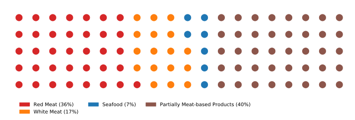

## Introduction

Meat consumption is a highly controversial topic in nowadays society in terms of environment, health, and ethical reasons. This situation introduces different ways of consuming meat and divides people according to their behaviors such as vegan, vegetarian, occasional meat consumer, and people consuming large amounts of meats. In this story, we will be telling you the tale about the consumption behavior of meat and vegetables. If you are intersted in learning what are the factors influencing meat consumption or how does meat consumption influence other aspects of our alimentation this story is for you.

## The Data

To tell our story, we will be using data collected over 2 years from frequent shoppers in the USA. It contains information about grocery shopping of 2500 households and the demographic information of 800 of them. We will be particularly focusing on 51,000 food products and their 2.1 million transactions.

<section id="key_numbers_data" markdown="1">

  

    

      <h5 class="card-title">2,1M</h5>
      
Transactions

    

  

  

    

      <h5 class="card-title">2500</h5>
      
Houselholds

    

  

  

    

      <h5 class="card-title">51K</h5>
      
Food products

    

  

</section>

<!-- For our analysis, we use the Dunnhumby dataset. It contains information about grocery shopping of 2500 households with the demographic information of 800 of them. We will be particularly focusing on 51,000 food products and 2.1 million transactions. -->

Among all food-related transactions, 16% of them are products containing meat (seafood products are considered as a type of meat). As a comparison, when looking at vegetables this number drop to 10%.

Among these meat products, 36% of them are red meat, 17% are white meat. We observe less seafood consumption which consists of only 7% of the transactions for the meat products.

  

  

     
  

  

The "Other" category contains all the products that contains meat but that we were not able to categorize properly (e.g meat sandwiches, bolognaise sauce, ...). 

## Time Analysis

Does our consumption of meat and vegeatable vary accorss the year?  This is the first question we will try to answer. To do so, let's look  at the number tansactions over the year for different type of food.



<section id="legend" markdown="1">

<em>*The graph above normalizes the total number of transactions of each category to 12 so that the expected score per month is 1.</em>

</section>

Our monthly consumption of vegetables, red and white meat stays pretty much constant. However, we can observe interesting variations for certain types of foods. 

For example, we have a peak for turkey on Thanksgiving and pumpkin in Halloween. Moreover, people seems to buy more seafood during the winter. 

Thus, preferences of people change seasonally or weekly (due to the special days) for some specific products but time does not seems to affect their meat and vegetable consumption in general.

## Demographic Factors

If time does not influence our consumption of meat and vegeatable, what does? 
Some people might think that men consume more meat than women so let's look at the consumption  of theses 2 groups.



As we can see from the figure above, women and men tend to spent very similar amount on meat and vegeatables. 

Let's now look at 2 others factors: age and income. 

<section id="sliders" markdown="1">
  

    

      

        
      

      

        
      

    

  

</section>

The ratio of spending on red meat and vegetables tends to increase with age. In contrast, we observe a decreasing trend when looking at white meat. In terms of income, richer people spend less portion of their money on meat and products containing meat. People in the highest income category spend a higher  portion of their money on seafood products.

  

  

    

      <button type="button" id="redmeat" class="btn btn-outline-dark active" onclick="redMeat()">Red Meat</button>
      <button type="button" id="whitemeat" class="btn btn-outline-dark" onclick="whiteMeat()">White Meat</button>
      <button type="button" id="seafood" class="btn btn-outline-dark" onclick="seafood()">Seafood</button>
      <button type="button" id="vegetables" class="btn btn-outline-dark" onclick="vegetables()">Vegetables</button>
    

  

  

  

  

     
  

  

## Group Comparison

We are now going to take a closer look at certain extreme groups of people and see which products are popular for them! We are specifically interested in three different comparisons. The first comparison is extreme meat consumers vs extreme vegetable consumers. Then, we compare people aged between 19-35 and above 55. Finally, we look at households with an income under 50K and above 100K. 

### Extreme Consumers

We selected, among all the households, the 5% that spent the biggest part of their food spendings on meat. These people were categorized as "extreme meat consumers". 
We did the same looking at spendings for vegetables to get the "extreme vegetable consumers".

Extreme meat consumers spend most of their money on meat and meat-related products like beef, wings ribs, primal cuts, etc... They also prefer unhealthy products like chips. Thus, their diet is protein-heavy and lack of other nutrients. In contrast, we observe a much more balanced diet in extreme vegetable consumers. They consume largely fresh products, fruits vegetables and also they consume beef, turkey, milk, and cheese as a protein source.



Looking specifically at meat spendings, we see that heavy meat buyers prefer to buy bovine meat (33%) followed by pork (24%) and poultry (21%). On the other hand, heavy vegetable buyers prefer to buy poultry (32%) followed by bovine meat (27%) and pork (19%).



### Demographic Groups

  

  

    

      <button type="button" id="youngold" class="btn btn-outline-dark active" onclick="youngOld()">Young vs Old</button>
      <button type="button" id="poorich" class="btn btn-outline-dark" onclick="poorRich()">Poor vs Rich</button>
    

  

  

  
Food

 
Meat

Although old and young people have similar preferences in general, old people tend to consume have a more balanced diet where they consume more fruit, juice, salad compared to chips and snacks.

In terms of income, people with lower income prefer to spend most of their money on meat and meat-related products whereas people with higher income spend their money more luxury products like wines, expensive cereals, and fruits.

## Notes
p-values are provided for equality of means via ANOVA test with a 95% confidence interval. 

All the error bars are computed using 95% confidence interval. 

