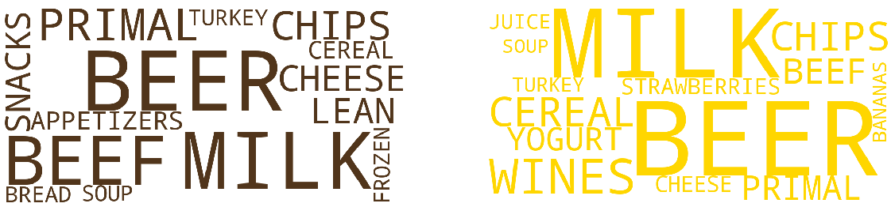

## Introduction

Meat consumption is a highly controversial topic in today's society in terms of environmental, health, and ethical issues. This introduces different ways of consuming meat and divides people according to their behaviors such as vegan, vegetarian, occasional meat consumer, and people consuming large amounts of meats. In this data story, we will be telling you the tale of consumption behavior concerning meat and vegetables on the household level. If you are interested in knowing what the factors affecting meat consumption are or how meat consumption influences other aspects of our alimentation, this story is for you.

## The Data

To tell our story, we will be using data collected over 2 years from frequent shoppers in the USA. It contains information about grocery shopping of 2500 households and demographic information of 800 of them. We will be particularly focusing on 51.000 food products and their 2,1 million transactions.

<section id="key_numbers_data" markdown="1">

  

    

      <h5 class="card-title">2,1M</h5>
      
Transactions

    

  

  

    

      <h5 class="card-title">2,5K</h5>
      
Houselholds

    

  

  

    

      <h5 class="card-title">51K</h5>
      
Food products

    

  

</section>

<!-- For our analysis, we use the Dunnhumby dataset. It contains information about grocery shopping of 2500 households with the demographic information of 800 of them. We will be particularly focusing on 51,000 food products and 2.1 million transactions. -->

Among all food-related transactions, 16% of them are products containing meat (seafood products are considered as a type of meat and include fish and other seafood). This number drops to 10% when we look at transactions for vegetables.

Among these transactions for meat products, 40% of them are for partially meat based-products (eg. meat sandwiches, bolognese, etc.). 36% of them are transactions related to red meat and 17% to white meat. We observe less seafood consumption consisting of only 7% of the transactions of meat products.

## Time Analysis

Does the meat and vegetable consumption vary in time? Are there any seasonal or monthly exceptions? This is the first question we will try to answer. To do so, let’s look at the number of transactions over the year for different types of food.



<section id="legend" markdown="1">

<em>*The graph above normalizes the total number of transactions of each category to 12 so that the expected score per month is 1.</em>

</section>

Monthly consumption of vegetables, red and white meat stays reasonably constant. However, we can observe interesting variations for certain types of foods. 

For example, we have a peak for turkey around Thanksgiving and for pumpkin during Halloween. Moreover, people seem to buy more seafood during the winter.

Thus, preferences of people change seasonally or weekly (due to special holidays) for some specific products but time does not seem to affect their meat and vegetable consumption in general.

## Demographic Factors

What about demographic factors? Are there any differences between men and women? Does the income of a household or age affect people's preferences?



As we can see from the figure above, women and men tend to spend a very similar amount of money on all types of meat. However, women spend slightly more than men on vegetables. Let's continue with age and income! 

<section id="sliders" markdown="1">
  

    

      

        
      

      

        
      

    

  

</section>

The ratio spent on red meat and vegetables tends to increase with age. In contrast, we observe a decreasing trend when we look at white meat. In terms of income, richer people spend a smaller portion of their money on meat and products containing meat. Another interesting observation is that the people in the highest income category spend a higher portion of their money on seafood products.

  

  

    

      <button type="button" id="redmeat" class="btn btn-outline-dark active" onclick="redMeat()">Red Meat</button>
      <button type="button" id="whitemeat" class="btn btn-outline-dark" onclick="whiteMeat()">White Meat</button>
      <button type="button" id="seafood" class="btn btn-outline-dark" onclick="seafood()">Seafood</button>
      <button type="button" id="vegetables" class="btn btn-outline-dark" onclick="vegetables()">Vegetables</button>
    

  

  

  

  

     
  

  

As they are getting poorer and older, households prefer red meat over white meat. On the contrary, white meat is more popular than red meat in rich and young households. Another interesting results is that seafood and vegetables are more popular among older and richer households.

As the number of people in each category is quiet small, those results shoud be taken carefully and more as qualitative trends. We refer you to our [complete analysis](https://nbviewer.jupyter.org/github/BenjaminEngelman/ADA-Project/blob/master/main.ipynb?flush_cache=true) for more details about stasitical significance.

## Group Comparison

We are now going to take a closer look at certain extreme groups of people and see which products are popular among them! We are specifically interested in three different comparisons. The first one is between extreme meat consumers and extreme vegetable consumers. Then, we compare people aged between 19-35 and above 55. Finally, we look at households with an income below 50K and above 100K. 

  

  

    

      <button type="button" id="extreme" class="btn btn-outline-dark active" onclick="update('extreme_div')">Extreme Consumers</button>
      <button type="button" id="youngold" class="btn btn-outline-dark" onclick="update('youngold_div')">Young vs Old</button>
      <button type="button" id="poorich" class="btn btn-outline-dark" onclick="update('poorrich_div')">Lowest vs Highest Income</button>
    

  

  

  <h3>Extreme Consumers</h3>

  
Among all the households, we select the 5% that spent the biggest part of their food expenses on meat. These people are categorized as "extreme meat consumers". We apply the same selection strategy to obtain the "extreme vegetable consumers".

  
We look at the products consumed by those groups. Then, we check their description and select the popular words among them. Red and green words represent extreme meat and extreme vegetable consumers respectively.

  

  
Extreme meat consumers spend most of their money on meat and meat-related products like beef, wings, ribs, primal cuts, etc... They also prefer unhealthy products like chips. Thus, their diet is protein-heavy and lacks other nutrients. In contrast, we observe a much more balanced diet in extreme vegetable consumers. They consume largely fresh products such as fruits or vegetables but also consume beef, turkey, milk, and cheese as a protein source.

  

  
Looking specifically at meat expends, we see that extreme meat consumers spend most of their money on bovine  meat (31%) followed by poultry and pork (both 24%).

  
On the other hand, extreme vegetable consumers spend most of their money to buy poultry (32%) followed by bovine meat (24%) and pork (19%). They also spend more money on seafood compared to extreme meat consumers (15% vs 10%). Thus, we can say that they tend to prefer poultry and seafood more than extreme meat consumers.

  

  Let's dive deeper into our analysis and look at the products for which the two groups have the most different behavior! We observe that extreme meat consumers tend to consume more beer and frozen pizza whereas extreme vegetables consumers prefer products such as soup, milk, yogurt and wine.

  <h3>Young vs Old</h3>

  
We select the households with people aged between 19 to 34 and above 55 to analyze their product and meat preferences.

  
We first look at the popular words in the description of the products consumed by those groups. Blue and brown words represent young and old consumers respectively.

  

  
Although old and young people have similar preferences in general, old people tend to have a more balanced diet where they consume more fruits, juices and salads compared to chips and snacks for the youngest households .

  
  
  

  
Youngest consumers mainly spends their money on poultry and bovine meat whereas oldest people prefer bovine and pork meat. 

  <h3>Lowest vs Highest Income</h3>

  
We select the households with income under 50K and above 100K and analyze their product and meat preferences.

  
We look at the popular words in the description of the products consumed by those groups. Dark-brown and yellow words represent the lowest and highest income consumers respectively.

  

  
Households with lower income tend to spend more on beef and snacks whereas higher income households spend more on fruits and wines.

  

  
Similar to our observations in the demographic factor section, we see that seafood and poultry are more popular in households with higher income. Looking at each plot separately, we observe that lowest income houselholds prefer pork over poultry whereas highest income households prefer poultry over pork.

## Notes
All the error bars are computed using 95% confidence interval. 
The detailed analysis of this project is available [here](https://nbviewer.jupyter.org/github/BenjaminEngelman/ADA-Project/blob/master/main.ipynb?flush_cache=true).

